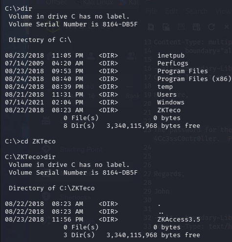

# Access提權

到根目錄發現有奇怪的目錄

這看起來是個安裝ZKTeco這個東西的檔案資料夾，裡面沒有看到有用的線索。

又回到user的目錄下找找線索，看看Public裡面有甚麼。

到桌面發現security system.lnk這個奇怪的檔案。

type出來看看，發現[runas.exe](https://swisskyrepo.github.io/InternalAllTheThings/redteam/escalation/windows-privilege-escalation/#hivenightmare)這個執行檔。查了一下發現它可以做身分切換的功能。它可以借用權限的概念。允許管理員使用 /savedcred 參數以管理員權限運行命令，而無需輸入密碼。 ****

到runas.exe的那個目錄下C:\Windows\System32。

輸入[runas.exe](https://swisskyrepo.github.io/InternalAllTheThings/redteam/escalation/windows-privilege-escalation/#hivenightmare)這上面找到的方法。

runas.exe /savecred /user:ACCESS\Administrator "cmd /c type C:\Users\Administrator\Desktop\root.txt > C:\Users\security\desktop\root.txt

runas.exe: Windows 內建工具，允許以另一個使用者身分執行程式。

/savecred: 告訴系統使用「先前已儲存」的憑證。如果 Administrator 曾經用這台電腦並存過密碼，你就不需要輸入密碼就能直接執行。

/user:ACCESS\Administrator: 
指定要借用的身分是 `ACCESS` 網域下的 `Administrator`。(這個是type出來知道的資訊)

"cmd /c ...”: 開啟一個新的命令視窗執行後面的指令，執行完畢後立即關閉 (`/c`)。

type ... > …: `type` 是讀取檔案內容，`>` 是**重新導向**。這整句意思是：讀取 Admin 桌面的 `root.txt` 並把它「寫入」到 security 使用者的桌面。

可以看到security這個使用者的底下有root.txt檔案，我不知道為什麼它附檔名後面會多cc。

接著cd 到該目錄下列出，root_flag。

END.