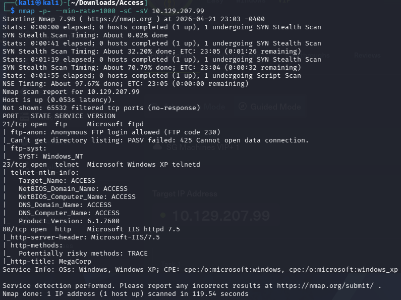

# Access

nmap -p- --min-rate=1000 -sC -sV 10.129.207.99

開了21、23、80PORT，ftp、telnet、http。

ftp可以匿名登入，裡面有兩個目錄，目錄內各有一個檔案。

get這目錄下的兩個檔案。backup.mdb&&Access Control.zip。

Access Control.zip需要密碼。

backup.mdb點開雖然有些字但一堆亂碼，就把這個.mdb的檔案用strings backup.mdb >> backup.txt轉成backup.txt的文字檔。在404行那看到很像密碼的字串。

拿去給剛剛壓縮檔內需要輸入密碼的檔案，結果成功了，拿到了Access Control.pst的檔案。

接著去查查看.pst檔能做甚麼事，網路上說可以安裝sudo apt-get install pst-utils，這個處理工具。

用readpst -r Access\ Control.pst的指令，將.pst檔轉換成可讀的mbox檔案。

打開後會看到是一封信，拿去用在telnet試試看 security:4Cc3ssC0ntr0ller。

成功登入並取得user_flag。

[Access提權](https://www.notion.so/Access-34a6b41a3784801d85bfcbb55aa2b82e?pvs=21)