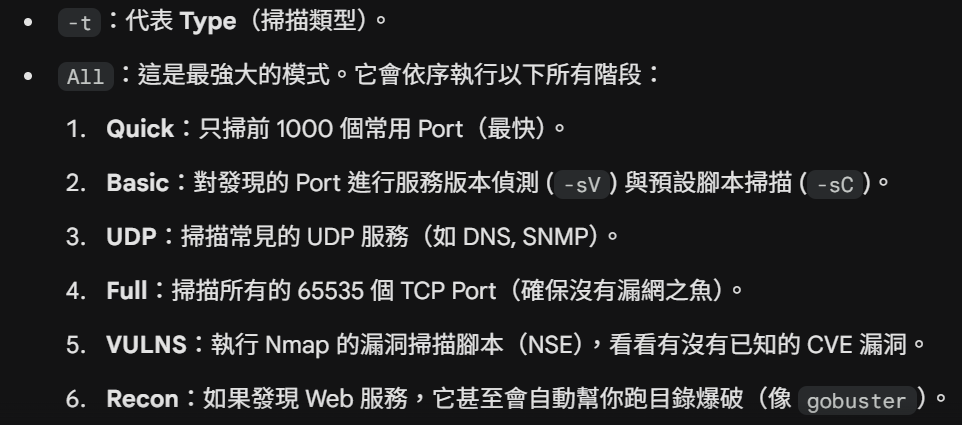

# Bashed

nmapAutomator.sh -H 10.129.219.242 -t All -o bashed.nmap

用腳本掃這個host並輸出成bashed.nmap資料夾，掃描結果在裡面。

80 port，HTTP。

看到網頁掃得有這些目錄。

phpbashshell是一個由開發者設計的 **Web Shell。**

進dev發現有phpbash.php，在url上面打這個路徑就進來shell，順利拿到user flag。

user_flag: e603c4bb81d3c21fa613a571ad4cbad4

[Based提權](https://www.notion.so/Based-3346b41a37848048997be014a9c1e607?pvs=21)