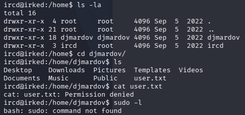

# Irked提權

順利混進來了，但user.txt需要提權。

我去Github找了[LinEnum.sh](https://github.com/rebootuser/LinEnum/blob/master/LinEnum.sh)載到本機。它是個掃描的腳本可能可以幫忙找到有趣的目錄。

在本機開一個http server。

接著再目標機器的/tmp目錄下wget 並賦予權限以及執行它。

它的interesting file下面優先去找擁有SUID和GUID權限的檔案，看到viewuser這個平常看不太到的檔案。

到usr/bin執行看看發現viewuser是透過tmp/listusers去執行的。

將/bin/bash指令寫入/tmp/listusers

到/tmp ，chmod +x listusers。

再到usr/bin去執行./viewuser，提權成功。

