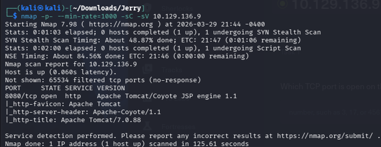

# Jerry

nmap -p- --min-rate=1000 -sC -sV 10.129.136.9

8080 HTTP。

從標題可以發現它這個版本有[CVE-2020-1938](https://www.cvedetails.com/cve/CVE-2020-1938/)的漏洞。

用目錄爆破，看到Tomcat的常見入口。

去了這個url後需要登入，隨便打了常見密碼admin:admin，進去後回報是403。

看到還有一個是host-manager/html的url，進去後看到它有admin-gui，比剛剛那個權限更高，登入成功可以直接拿到shell。

它有帳號密碼就進來了tomcat:s3cret。

用msfvnom載shell。

上傳成功。

開新的tab，開監聽成功拿到shell。

進去後whoami，發現我已經是最高權限了。

就可以type這兩個flag了。

user_flag: 7004dbcef0f854e0fb401875f26ebd00

root_flag: 04a8b36e1545a455393d067e772fe90e