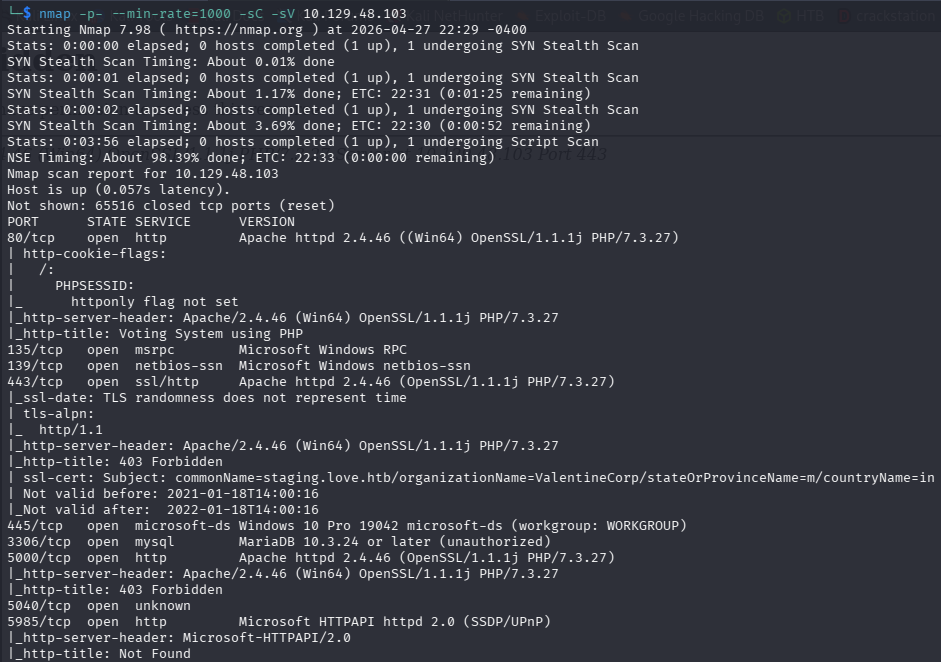

# Love

nmap -p- --min-rate=1000 -sC -sV 10.129.48.103

We have HTTP on port 80 and 5000, HTTPS, SMB, and MYSQL

 before that  I need to add the domain and subdomain in the host’s file.

sudo vim /etc/hosts

We have a voting system for this web application using PHP programming language so let’s use feroxbuster:

feroxbuster -u [http://10.129.48.103](http://10.129.48.103/) -q -k

I don’t find anything interesting let’s use Searchsploit to check if we find any exploit.

I found RCE :49445.py but need cred.

this sudo domain works on HTTP and I found this page.

I have input take URL, Let’s test SSRF

http://localhost:5000

 admin : @LoveIsInTheAir!!!! 

Now i need to copied this file

then r**evise file**

**implement it**

[Love 提權](https://www.notion.so/Love-3516b41a378480d6bdded127019afae6?pvs=21)