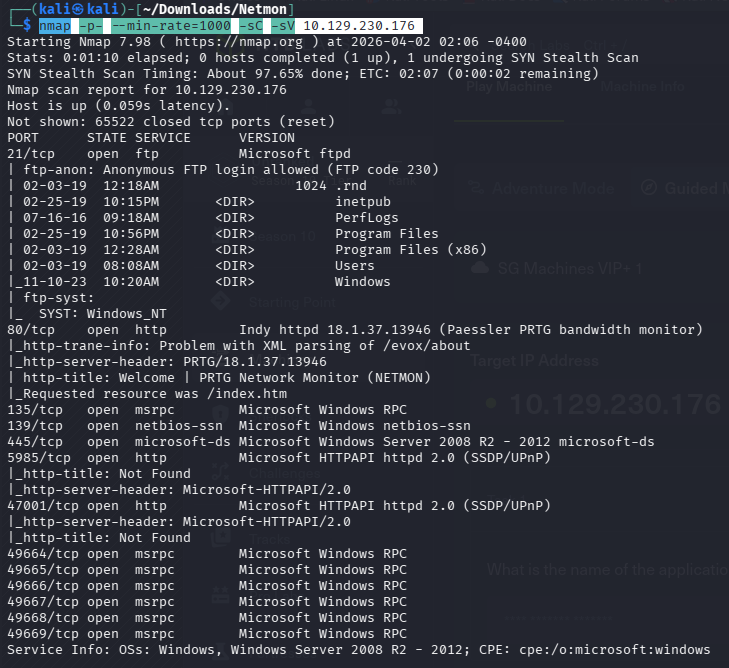

# Netmon

nmap -p- --min-rate=1000 -sC -sV 10.129.230.176 

21、80、135、139、445、5985、47001、49664~49669，FTP、HTTP、RPC、Netbios、samba、WinRM 2.0 、RPC。

用ftp 匿名登入可以拿到user.txt.

之後去網路上查prtg的預設路徑為何

用wget抓下來

有看到'PRTG Configuration.old.bak’，cat後看到密碼。

回網頁登入看看發現是錯的。prtgadmin:PrTg@dmin2018，後來密碼改成2019就成功了。

網頁底下看到PRTG版本，查查看它有[CVE-2018-9276](https://nvd.nist.gov/vuln/detail/CVE-2018-9276)的漏洞**。**

漏洞說明: 只要攻擊者能登入 PRTG 管理介面，而且是 admin 權限，就可以把系統原本要執行的指令「偷改」成自己的惡意指令，進而控制主機或網路設備。

就去[github](https://github.com/A1vinSmith/CVE-2018-9276/tree/main?source=post_page-----9b6649f1c449---------------------------------------)找找看reverseshell的python檔。用git去載它。

開監聽，用git上面的exploit.py的指令。

成功reverseshell。

root_flag:48d18e9c28c6eb42eef646f06114d9ac

