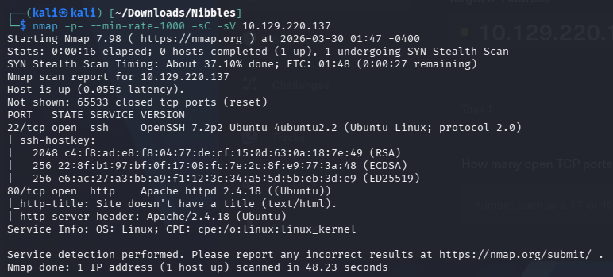

# Nibbles

nmap -p- --min-rate=1000 -sC -sV 10.129.220.137

發現Apache/2.4.18有 [CVE-2024-38475](https://www.cvedetails.com/cve/CVE-2024-38475/)漏洞。

網頁發現它沒甚麼特別的，只有Hello world!，按F12跑出有點特別的東西。

進來用forexbuster爆爆看。

feroxbuster -u [http://10.129.170.21/nibbleblog](http://10.129.170.21/nibbleblog) -w /usr/share/wordlists/dirbuster/directory-list-2.3-medium.txt -x php,txt,html -q

找到幾個比較重要的，admin、content、plugins、README。

README裡面看到version為4.0.3。

Content

在private/users.xml看到user是admin。

在private/config.xml下看到admin的email。

在content/public下發現有個upload的子目錄。

由於前面有這個blog的版本，可以searchexploit。在瀏覽器搜[Nibbleblog 4.0.3 Arbitrary File Upload](https://packetstorm.news/files/id/133425)

第二點最後有說需要管理員的權限，那我們得先到登入頁面嘗試登入。

猜了admin:admin、nibbles:admin、admin:nibbles，第三個是正確的

開監聽。

照著上面的方法到plugins找到image —>configure，這地方可以上傳檔案，它是php的程式語言，可以把reverseshell傳上去。

成功拿到shell了。

user_flag: e717b64682fd382788346443ca0b191f

[Nibbles提權](https://www.notion.so/Nibbles-3336b41a3784808dae8df1ed8b9a8ba8?pvs=21)