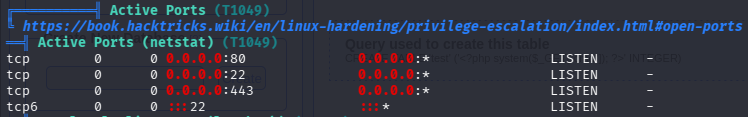

# Nineveh提權

用linpeas.sh也沒有太大發現，但有看到這個22 port，用nmap的時候沒有掃出來，用pspy去監控看看。

發現這個檔案chkrootkit，會每隔一段時間執行一次。

好奇這個22為什麼掃不到，就去linpeas.sh找找看，看到amrois這個使用者mail的相關文件，兩封分別cat 下來看看是甚麼。

兩封的內容都是一樣的，後面數字蠻特別的。571 290 911

問了AI說它是一種隱藏服務的方法，要用敲門的方式才能打開。

knock 10.129.205.104 571 290 911

開了後要找amrois這位使用者的密碼，在這路徑下。

用strings nineveh.png來解析這張圖片。
從二進位檔案（例如圖片、執行檔）中提取出可讀的純文字字串。

找到可能是amrois的私鑰。

用ssh私鑰的方式成功登入amrois這位使用者的帳號。

接著去查chkrootkit的exploit，https://www.exploit-db.com/exploits/33899

這個漏洞在slapper()函數中，如果 `$file_port` 為空（因為變數賦值語句缺少引號），則 `file_port=$file_port $i` 這行程式碼將以 chkrootkit 執行使用者（通常是 root 使用者）的身分執行 `$SLAPPER_FILES` 中指定的所有檔案。

照著他給的steps 做，先在/tmp底下建立一個update的檔案。

賦予權限後等待chkrootkit執行。

用pspy64看到它執行了/tmp下的檔案。

因為我剛剛下的指令是當執行時root.txt會cat 到amrois這個使用者的家目錄。

所以現在root.txt會在/home/amrois/root.txt這邊。

END.