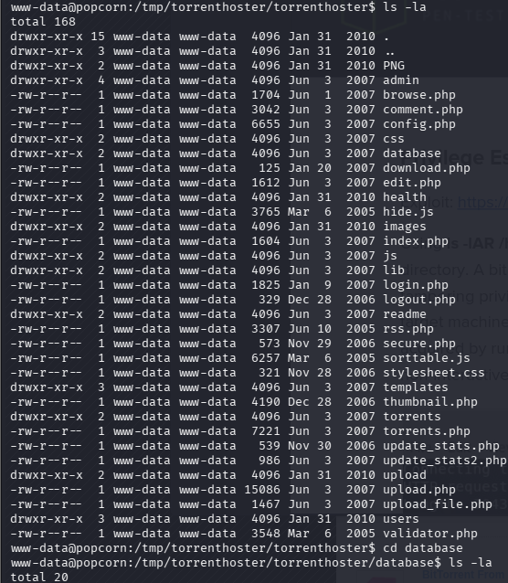

# Popcorn提權

在george目錄下有個zip檔，複製到tmp下解壓縮看看裡面有甚麼。

把像config、login、database，那些都瀏覽過一遍，只有database目錄下的sql有一點線索，但感覺是騙人的。拿到Admin:admin12(hash解出來的)，但哪都沒辦法進。

都讀完後感覺沒甚麼有用的，就回到george的目錄 ls -la /home/george。

前面兩個用過了，.sudo和.profile沒甚麼東西，.cahe是個目錄可以去看一下。

有個很奇怪的檔案，motd.legal-displayed，它就單純是個空白檔案，當觸發點。

我在本機用了searchsploit motd，發現有兩個全縣竄改提升的腳本。

看它對應的Linux PAM 1.1.0 (Ubuntu 9.10/10.04):  去問了一下發現，pam 1.1.0的會有motd的提權漏洞，後面是指受影響的作業系統版本。

用uname -a看一下目標機器的linux版本，只知道它是09年的。

用dpkg -l 確認PAM版本。

ubuntu-keyring 2009.08.28:
這顯示了金鑰庫的日期是 **2009 年 8 月**。這完全符合 Ubuntu 9.10 在 2009 年底發布的時間線。

ubuntu-serverg 9.10.11:
這台機器的作業系統版本就是 **Ubuntu 9.10** (Karmic Koala)。

驗證完後，用searchsploit -m 14339下載到本機。

開一個HTTP server，在目標機tmp目錄下用wget。

用chmod +x [14339.sh](http://14339.sh/)賦予權限並執行，發現它需要ssh驗證，但我沒密碼，不適用這個腳本。

我就拿去問，它說我能用Full-Nelson([CVE-2010-3081](https://www.exploit-db.com/exploits/15704))，**'Full-Nelson.c' 本地權限提升。**

重新載了15704。

開http server。

到目標機wget。

將15704.c做編譯並輸出成exploit檔，接著執行它。

成功提權

root_flag: 80f4656b7bf38afc5e272542979f07b1