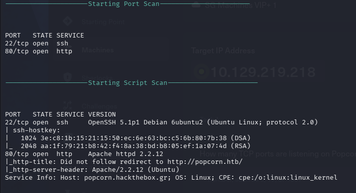

# Popcorn

一樣用腳本先掃過: nmapAutomator -H 10.129.219.218 -t All -o Popcorn.nmap

22、80port，ssh、HTTP。

感覺是需要重導向，sudo vim /etc/hosts。

可以了。

用了feroxbuster -u [http://popcorn.htb](http://popcorn.htb/) -k，在test找到python的版本，也有看到.PHP，可以上傳reverseshell。

還有很多東西可以看看。

-k: 忽略TLS錯誤繼續掃描。

TLS傳輸層安全協定。

看到爆破出來的目錄[http://popcorn.htb/torrent](http://popcorn.htb/torrent)/ ，這才是它的主網頁。

看到右上角有Register，我創一個user。vicnumber:kkk123@

登入後看到有upload頁面。

將php-reverse-shell.php upload到torrent。它需要附檔名為torrent的file。

用mktorrent php-reverse-shell.php更改副檔名為php-reverse-shell.php.torrent

上傳成功，要去upload觸發它。

在upload這路徑看到只有圖片檔。

回到上傳成功頁面發現底下有個編輯torrent的按鈕。

點下去後發現能從這邊把檔案傳到upload，但它附檔名需要是圖片檔的副檔名。

這裡想到開burp抓submit Screenshot的封包。

改了content -type:image/png，接著forward，在到upload就能看到檔案成功上傳。

觸發前開監聽，接著觸發，成功reverse shell。

user_flag:　b157dee93572d60f8f02e14c5f4055a7

[Popcorn提權](https://github.com/jeremypickup/cybersecurity-notes/blob/main/Popcorn/Popcorn%20PE/Popcorn%20PE.md)
