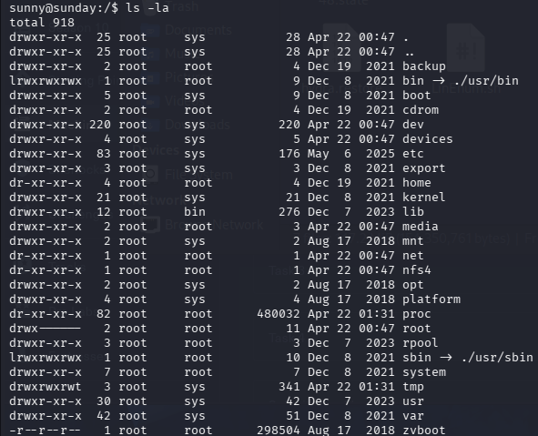

# Sunday提權

回到sunny的根目錄ls -la

看到backup(備份)的目錄，到backup ls -la。看到shadow.backup蠻特別的就cat，發現底下有兩個使用者的hash，是用sha256($5$)、salt($Ebkn8jlK)、後面是hash本體。

把這兩個建成一個hash.txt的文字檔，用john來解密這兩個密碼。

john --format=sha256crypt hash.txt，這個是前面已知的sunny的密碼，但沒有sammy的，用rockyou.txt去補字典。

john --wordlist=/usr/share/wordlists/rockyou.txt --rules --format=sha256crypt hash.txt，成功找到sammy的密碼。

拿到user.txt

sudo -l看看sammy的權限，發現它可以透過執行(root) NOPASSWD: /usr/bin/wget去提權。

就去問一下怎麼觸發這個來做提權，G說可以參考[GTFOBins](https://gtfobins.org/gtfobins/wget/)。

到tmp的目錄下，創一個$AA把腳本寫進去，賦予權限後，用sudo執行/usr/bin/wget來提權。

END.