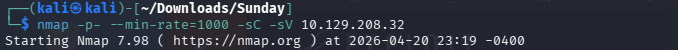

# Sunday

nmap -p- --min-rate=1000 -sC -sV 10.129.208.32

開了79、111、515、6787跟22022的port，finger、RPC、printer、Sun Web Console Admin、ssh(被移到22022)。

79/TCP是個很舊的service，主要用來查詢系統上的使用者資訊。

在pentestmonkey上能夠找到使用者文檔的指令，[finger-user-enum](https://pentestmonkey.net/tools/user-enumeration/finger-user-enum?source=post_page-----b476a208b1d8---------------------------------------)。

用wget到github載[finger-user-enum.pl](https://raw.githubusercontent.com/pentestmonkey/finger-user-enum/master/finger-user-enum.pl)，接著賦予權限chmod +x finger-user-enum.pl。

./finger-user-enum.pl -U /usr/share/seclists/Usernames/Names/names.txt -t 10.129.208.32
找到有這些user。

把找到的user用hydra去爆爆看密碼，很幸運的有爆到sunny的login:password。

hydra -l sunny -P /usr/share/seclists/Passwords/Common-Credentials/probable-v2_top-1575.txt -s 22022 ssh://10.129.208.32 -v

接者可以用sunny這個user去登入ssh，也能進入solaris的頁面。

在sunny的家目錄下沒有翻到特別的檔案。

回到home目錄下來有另外一個user叫sammy，sammy底下有user.txt，cat後發現沒有權限，只能另尋他路。

[Sunday提權](https://github.com/jeremypickup/cybersecurity-notes/blob/main/Sunday/Sunday%20PE/Sunday%E6%8F%90%E6%AC%8A.md)
